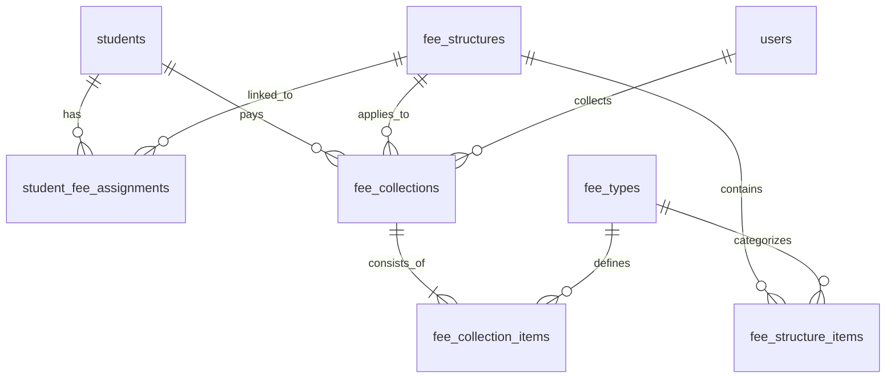
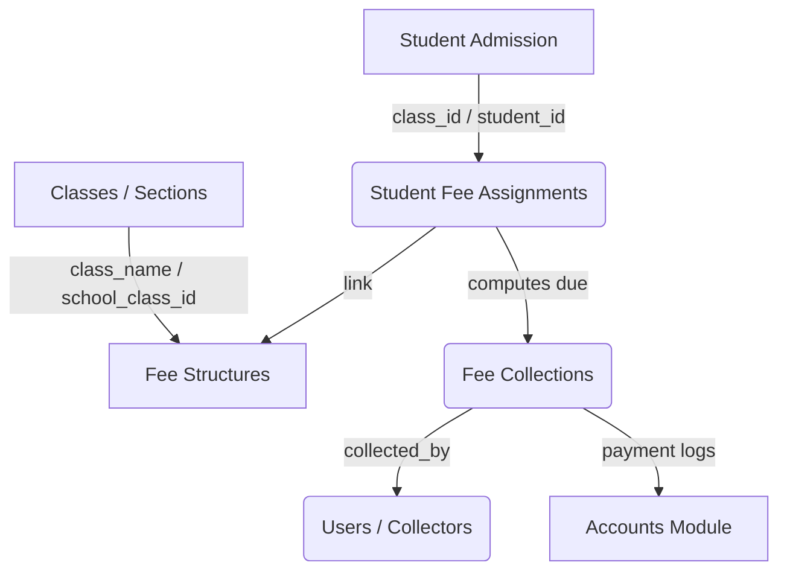

# MASTER AUDIT REPORT: Fee Management System

---

## Executive Summary & System Health Card

This document provides a comprehensive architectural, database, functional, and security audit of the **HelpingHand School Fee Management System**. 

| Category | Rating | Summary of Findings |
| :--- | :--- | :--- |
| **System Architecture** | **5.5 / 10** | Dual parallel fee systems exist in the codebase: a legacy/quarantined "Professional" system (using `fee_heads` / `fee_structure_details`) and the **active standard system** (using `fee_types` / `fee_structure_items`). This split creates code clutter and developer confusion. |
| **Database Design** | **6.0 / 10** | The schema is normalized for the active system, but contains critical migration ordering issues (e.g., recreating tables without dropping dependencies) and missing composite/foreign key indexes. |
| **Functional Integrity** | **4.0 / 10** | **CRITICAL BUG**: The active fee system's monthly dashboard payment status check (`getPaymentStatus`, `getCollectionId`, and `calculatePendingFees`) ignores the target month. Paying a fee type once for any month marks that fee type as "Paid" for all 12 months. |
| **Security & Auditing** | **8.5 / 10** | Strong transaction-locking mechanics exist via a dedicated `FeePaymentLockService` to prevent race conditions and duplicate payments (double click protection) using 10s payload and 60s token locks. |
| **Scalability & Performance** | **5.0 / 10** | Defaulter calculations and pending fee queries suffer from severe N+1 query patterns, making loops across all students slow. |

---

## PHASE 1 – DISCOVERY & INVENTORY

The codebase contains a mixture of active, legacy, and quarantined components. Below is the complete inventory of fee-related files.

### 1. Controllers
* **Active System (Admin Panel)**:
  * [FeeStructureController](file:///c:/xampp/htdocs/HelpingHand/app/Http/Controllers/Admin/FeeStructureController.php) (CRUD operations for class fee structures)
  * [FeeCollectionController](file:///c:/xampp/htdocs/HelpingHand/app/Http/Controllers/Admin/FeeCollectionController.php) (Handles student payments, collections, search, and receipts)
  * [InstallmentFeeController](file:///c:/xampp/htdocs/HelpingHand/app/Http/Controllers/Admin/InstallmentFeeController.php) (Installment scheduling and collections)
  * [FeeAutomationController](file:///c:/xampp/htdocs/HelpingHand/app/Http/Controllers/Admin/FeeAutomationController.php) (Pending fees, reminders, and defaulter tracking)
* **Parent Portal**:
  * [ParentPaymentController](file:///c:/xampp/htdocs/HelpingHand/app/Http/Controllers/Parent/ParentPaymentController.php) (View outstanding dues, initiate checkout, Stripe handler)
* **API Endpoints**:
  * [API\StudentController](file:///c:/xampp/htdocs/HelpingHand/app/Http/Controllers/API/StudentController.php) (Contains student-specific `fees` retrieval logic)
* **Legacy/Quarantined Systems**:
  * [ProfessionalFeeManagementController](file:///c:/xampp/htdocs/HelpingHand/app/Http/Controllers/Admin/ProfessionalFeeManagementController.php) (Disabled routes; relies on legacy structure)
  * [PaymentController](file:///c:/xampp/htdocs/HelpingHand/app/Http/Controllers/PaymentController.php) (Legacy online payment processor)

### 2. Models
* **Active Models**:
  * [FeeType](file:///c:/xampp/htdocs/HelpingHand/app/Models/FeeType.php) (Represents core fee categories: Tuition, Admission, etc.)
  * [FeeStructure](file:///c:/xampp/htdocs/HelpingHand/app/Models/FeeStructure.php) (Ties fee structures to classes and years)
  * [FeeStructureItem](file:///c:/xampp/htdocs/HelpingHand/app/Models/FeeStructureItem.php) (Individual fee type amounts and dues per structure)
  * [StudentFeeAssignment](file:///c:/xampp/htdocs/HelpingHand/app/Models/StudentFeeAssignment.php) (Maps students to their active fee structures)
  * [FeeCollection](file:///c:/xampp/htdocs/HelpingHand/app/Models/FeeCollection.php) (Main transaction records/receipt details)
  * [FeeCollectionItem](file:///c:/xampp/htdocs/HelpingHand/app/Models/FeeCollectionItem.php) (Detailed line items of a fee collection transaction)
* **Legacy/Quarantined Models**:
  * [FeeHead](file:///c:/xampp/htdocs/HelpingHand/app/Models/FeeHead.php) (Component in the quarantined system)
  * [FeeStructureDetail](file:///c:/xampp/htdocs/HelpingHand/app/Models/FeeStructureDetail.php) (Quarantined system details)
  * [Fee](file:///c:/xampp/htdocs/HelpingHand/app/Models/Fee.php) (The original basic fee model)

### 3. Routes
All main routes reside in [web.php](file:///c:/xampp/htdocs/HelpingHand/routes/web.php).
* **Active Fee Structures Resource**: `admin/fee-structures` (mapping to `FeeStructureController`)
* **Active Collection & Search**: `admin/fees`, `fees/search-students`, `fees/student/{id}/dashboard`, `fees/collect/{studentId}`, `fees/process-collection`, `fees/receipt/{id}`, `fees/receipt/{id}/pdf` (mapping to `FeeCollectionController` and `FeeReceiptController`)
* **Automation**: `fees/pending`, `fees/defaulters`, `fee-dashboard`, `fees/send-whatsapp-reminder` (mapping to `FeeAutomationController`)
* **Installments**: `admin/installment-fees` (mapping to `InstallmentFeeController`)
* **Parent portal checkout**: `parent/payments/pay-fees` (mapping to `ParentPaymentController`)
* **API Route**: `/api/students/{id}/fees` (in `routes/api.php` mapping to `API\StudentController@fees`)

### 4. Database Migrations
* **Active System**:
  * `2026_02_12_100000_create_fee_types_table.php`
  * `2026_02_12_100001_create_fee_structures_table.php`
  * `2026_02_12_100002_create_fee_structure_items_table.php`
  * `2026_02_12_100003_create_student_fee_assignments_table.php`
  * `2026_02_12_100004_create_fee_collections_table.php`
  * `2026_02_12_100005_create_fee_collection_items_table.php`
  * `2026_02_12_100006_add_fee_month_to_fee_collections_table.php`
* **Legacy/Quarantined System**:
  * `2026_01_22_050134_create_fees_table.php`
  * `2026_02_12_000000_create_professional_fee_management_system.php` (creates legacy `fee_heads`, `fee_structure_details`, `student_fee_assignments`, `fee_collections`, `fee_receipts`, `fee_discounts`, `student_fee_discounts`)

### 5. Services
* [FeePaymentLockService](file:///c:/xampp/htdocs/HelpingHand/app/Services/FeePaymentLockService.php) (Active token/fingerprint locking)
* [FeeReceiptNumberService](file:///c:/xampp/htdocs/HelpingHand/app/Services/FeeReceiptNumberService.php) (Generates sequence-based unique receipt numbers)
* [PaymentGatewayService](file:///c:/xampp/htdocs/HelpingHand/app/Services/PaymentGatewayService.php) (Parent portal checkout gateway - Mocked)
* [Payment\StripePaymentService](file:///c:/xampp/htdocs/HelpingHand/app/Services/Payment/StripePaymentService.php) (Active Stripe charge client wrapper)
* [ProfessionalFeeManagementService](file:///c:/xampp/htdocs/HelpingHand/app/Services/ProfessionalFeeManagementService.php) (Quarantined legacy service)

### 6. Notifications & Views
* **Notifications**: [FeePaymentReminder](file:///c:/xampp/htdocs/HelpingHand/app/Notifications/FeePaymentReminder.php) (sends mail notification)
* **Blade Views**:
  * Fee Collections: `resources/views/admin/fees/` (contains `index`, `show`, `collect-form`, `student-dashboard`, `receipt`, `receipt-pdf`, `dashboard`, `pending`, `defaulters`)
  * Fee Structures: `resources/views/admin/fee-structures/` (contains `index`, `create`, `edit`, `show`)
  * Parent Payments: `resources/views/parent/payments/pay-fees.blade.php`

---

## PHASE 2 – DATABASE ANALYSIS

The database contains tables for both systems. Here is the analysis of the **Active System** tables:

### Relationship Map (Active Schema)



### Active Schema Tables & Columns

#### 1. `fee_types`
* **Purpose**: Defines fee heads (e.g., "Tuition Fee", "Admission Fee").
* **Columns**:
  * `id` (bigint, PK)
  * `name` (varchar): Unique name of the fee type.
  * `description` (text, nullable): Notes.
  * `is_optional` (tinyint): If true, optional.
  * `status` (enum ['active', 'inactive'])
  * `created_at`/`updated_at`/`deleted_at`

#### 2. `fee_structures`
* **Purpose**: Dictates class-level fee pricing and schedules.
* **Columns**:
  * `id` (bigint, PK)
  * `class_name` (varchar): Class name index.
  * `academic_year` (varchar): E.g. "2026-27".
  * `frequency` (enum ['monthly', 'quarterly', 'yearly', 'custom'])
  * `status` (enum ['active', 'inactive'])
  * `created_by` (bigint, FK to `users.id`)
  * `installment_count` (int): Number of installments.
  * `installment_frequency` (varchar): installment interval.

#### 3. `fee_structure_items`
* **Purpose**: Associates fee types with structures and holds values.
* **Columns**:
  * `id` (bigint, PK)
  * `fee_structure_id` (bigint, FK to `fee_structures.id`)
  * `fee_type_id` (bigint, FK to `fee_types.id`)
  * `amount` (decimal 10,2): Price for this item.
  * `due_day` (int, nullable): The day of the month payment is due.

#### 4. `student_fee_assignments`
* **Purpose**: Assigns specific structures to students.
* **Columns**:
  * `id` (bigint, PK)
  * `student_id` (bigint, FK to `students.id`)
  * `fee_structure_id` (bigint, FK to `fee_structures.id`)
  * `academic_year` (varchar)

#### 5. `fee_collections`
* **Purpose**: Transaction receipts.
* **Columns**:
  * `id` (bigint, PK)
  * `receipt_no` (varchar, unique): Generated automatically (`SCH-REC-XXXX`).
  * `student_id` (bigint, FK to `students.id`)
  * `fee_structure_id` (bigint, FK to `fee_structures.id`)
  * `total_amount` (decimal 10,2)
  * `discount` (decimal 10,2, default 0)
  * `late_fine` (decimal 10,2, default 0)
  * `final_amount` (decimal 10,2): calculated `total - discount + late_fine`.
  * `payment_date` (date)
  * `payment_mode` (enum ['cash', 'upi', 'bank', 'online'])
  * `remarks` (text, nullable)
  * `collected_by` (bigint, FK to `users.id`)
  * `fee_month` (varchar, nullable): Stores transaction payment date.

#### 6. `fee_collection_items`
* **Purpose**: Breakdowns of collected funds per receipt.
* **Columns**:
  * `id` (bigint, PK)
  * `fee_collection_id` (bigint, FK to `fee_collections.id`)
  * `fee_type_id` (bigint, FK to `fee_types.id`)
  * `amount` (decimal 10,2)

---

## PHASE 3 – BUSINESS WORKFLOWS

### 1. Fee Structure Creation
* **Trigger**: Admin inputs a new structure on `/admin/fee-structures/create`.
* **Action**: `FeeStructureController@store` validates inputs, inserts into `fee_structures` and `fee_structure_items`, then runs `autoAssignToStudents()` which bulk inserts student mapping records into `student_fee_assignments`.

### 2. Fee Collection
* **Trigger**: Accountant fills collection details on `fees/collect/{studentId}`.
* **Action**: Submitting calls `processCollection()` or `collectFee()` in `FeeCollectionController`. A fingerprint lock is acquired, a database transaction is started, records are inserted into `fee_collections` and `fee_collection_items`, the transaction is committed, and the accountant is redirected to `admin.fees.receipt`.

### 3. Online Parent Portal Payments
* **Trigger**: Parent clicks "Student Profile / Pay Fees" online.
* **Action**: `ParentPaymentController@showPaymentForm` checks pending fees using a join:
  ```sql
  SELECT SUM(amount) FROM fee_structure_items WHERE fee_structure_id = ...
  ```
  subtracting completed collections. Initiates checkout via `processStripePayment()`, redirecting to success callback `callbackSuccess()` which creates the collection entry.

---

## PHASE 4 – CODE FLOW TRACE

### Tracing Fee Collection (Cash / Manual)
```
[Route] Post Request to "fees/process-collection"
  ↓
[Controller] FeeCollectionController@processCollection
  ↓ (Validate inputs: student_id, fee_types, payment_mode, amounts)
[Service] FeePaymentLockService@generateFingerprint & acquireFingerprintLock
  ↓ (Check duplicate submissions in cache)
[Database Transaction]
  ↓ (Fetch Student and active FeeStructure)
  ↓ (Insert into fee_collections table)
  ↓ (Loop fee_types and insert into fee_collection_items table)
[Commit]
  ↓
[Redirect] Route "admin.fees.receipt"
  ↓
[View] resources/views/admin/fees/receipt.blade.php
```

---

## PHASE 5 – PAYMENT & CALCULATION LOGIC

### 1. Final Amount Calculation
The formula is calculated directly in the controller before database insertion:
```php
$totalAmount = $validated['total_amount'];
$lateFine = $validated['late_fine'] ?? 0;
$discount = $validated['discount'] ?? 0;
$finalAmount = $totalAmount + $lateFine - $discount;
```

### 2. installment Schedule Logic
`InstallmentFeeController::generateInstallmentScheduleData` handles dividing structure values:
```php
$totalAmount = $feeStructure->feeStructureItems->sum('amount');
$installmentAmount = $totalAmount / $feeStructure->installment_count;

for ($i = 0; $i < $feeStructure->installment_count; $i++) {
    // Increment months based on installment frequency (monthly, bimonthly, quarterly)
    $dueDate->addMonths($i * $frequencyMultiplier);
}
```

---

## PHASE 6 – REPORTING & ANALYTICS

1. **Dashboard Overview**:
   * Uses simple Carbon date queries:
   ```php
   $todayCollection = FeeCollection::today()->sum('final_amount');
   $monthlyCollection = FeeCollection::currentMonth()->sum('final_amount');
   ```
2. **Defaulter List**:
   * Loops through all students, checks expected items for active assignment, compares to paid collections, and compiles lists of students with unpaid months $\ge 2$.

---

## PHASE 7 – SECURITY & VALIDATION

### 1. Double Payment Protection
The active system uses a state-of-the-art dual-lock system inside `FeePaymentLockService`:
1. **Submission Token Lock**: Prevents fast double-submissions using a unique token (held in cache for 60 seconds).
2. **Payload Fingerprint Lock**: Generates an MD5 hash of:
   `[user_id, student_id, amount, fee_types, payment_date, payment_mode]`
   If the same payload is submitted within 10 seconds, it is rejected.

### 2. Transaction Integrity & Rollbacks
Transactions are wrapped inside retry loops (up to 3 attempts) to handle concurrency/race condition collisions:
```php
while ($attempt < $maxAttempts) {
    try {
        DB::beginTransaction();
        ...
        DB::commit();
    } catch (\Exception $e) {
        DB::rollback();
        ...
    }
}
```

---

## PHASE 8 – COMPONENT DEPENDENCIES



---

## PHASE 9 – IMPROVEMENT REPORT & CRITICAL ISSUES

### 1. The Month Filtering Bug (Critical Priority)
**Problem**: The payment queries in `calculatePendingFees` and `getPaymentStatus` do not filter by the target month.
```php
$paidItems = $student->feeCollections()
    ->whereHas('feeCollectionItems', function($query) use ($item) {
        $query->where('fee_collection_items.fee_type_id', $item->fee_type_id);
    })->get();
```
Because the date string (`payment_date`) is stored in `fee_month` instead of the billing month reference, paying a fee type once counts as paid for all months in the dashboard.
* **Refactoring Opportunity**: Update `fee_month` to record string identifiers (e.g., `'April 2026'`) and add `->where('fee_collections.fee_month', $month)` to the paid item check queries.

### 2. N+1 Queries in Defaulters/Reminders
**Problem**: Both `FeeAutomationController` and `InstallmentFeeController` loop through all students and perform database queries inside loops for every single student assignment and fee collection item.
* **Refactoring Opportunity**: Eager load relation tables or use a database view joining assignments and collections grouped by month.

### 3. Duplicate/Legacy Database Migrations
**Problem**: The `fee_structures` table is created in `2026_01_22_050157_create_fee_structures_table.php`, but recreation migrations run `Schema::create` again, causing execution collisions on fresh setup attempts.
* **Refactoring Opportunity**: Consolidate migrations into single build states and clear out legacy, dead-code tables (`fee_heads`, `fee_structure_details`, `student_fee_discounts`, `fee_discounts`).

### 4. Mocked Gateway Callback Vulnerability
**Problem**: `ParentPaymentController::callbackSuccess` takes raw request params from a redirected GET query to save paid transactions without checking Stripe signature integrity.
* **Refactoring Opportunity**: Move collection creation to Stripe webhook endpoint checking standard webhook headers.
